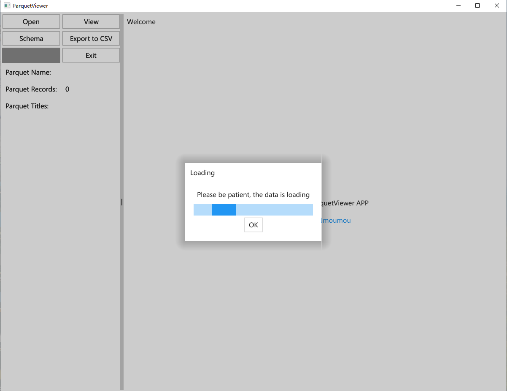
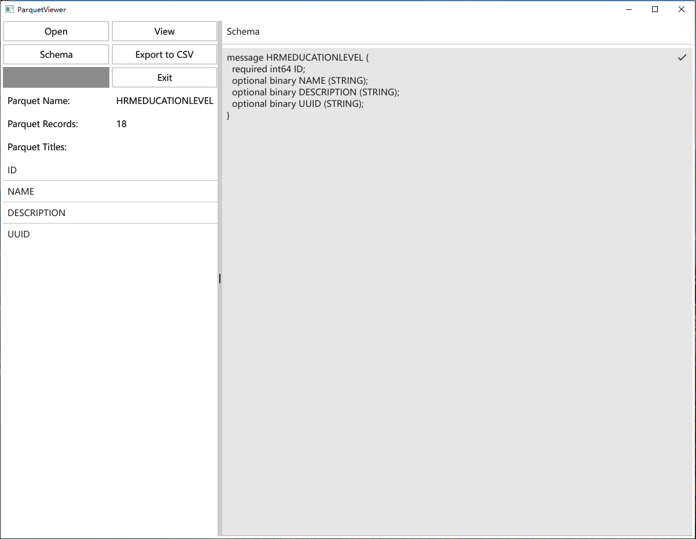

# ParquetViewer

**Only available for windows version download**

### **Currently supported features**

1. 20 records preview
2. Total number of file records
3. File structure
4. Support to convert to CSV

### **future features**

1. SQL-like query function

### Reference library

[fyne.io/fyne/v2](https://pkg.go.dev/github.com/fraugster/parquet-go@v0.10.0)

[github.com/fraugster/parquet-go](https://pkg.go.dev/github.com/fraugster/parquet-go@v0.10.0)

------

**当前仅提供Windows版程序下载(确保系统安装微软雅黑字体)**

### **当前支持功能**

1. parquet文件记录预览（20条）
2. parquet文件记录总数
3. parquet文件结构详情
4. parquet文件转CSV

### **计划功能**

1. 类SQL查询功能

### 引用库

[fyne.io/fyne/v2](https://pkg.go.dev/github.com/fraugster/parquet-go@v0.10.0)

[github.com/fraugster/parquet-go](https://pkg.go.dev/github.com/fraugster/parquet-go@v0.10.0)